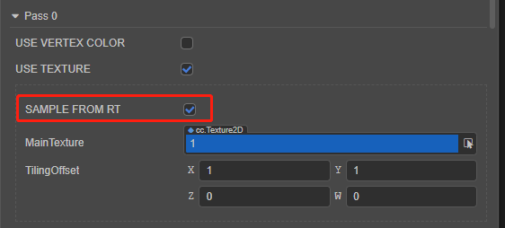

# 渲染纹理资源（RenderTexture）

渲染纹理是一张在 GPU 上的纹理。通常我们会把它设置到相机的 **目标纹理** 上，使相机照射的内容通过离屏的 `frambuffer` 绘制到该纹理上。一般可用于制作汽车后视镜，动态阴影等功能。

## 使用 RenderTexture

```typescript
// 方法一：把 3D 相机照射的内容绘制到 UI 的精灵帧上
export class CaptureToWeb extends Component {
    @property(Sprite)
    sprite: Sprite = null;
    @property(Camera)
    camera: Camera = null;

    protected _renderTex: RenderTexture = null;

    start () {
        const spriteframe = this.sprite.spriteFrame;
        const sp = new SpriteFrame();
        sp.reset({
            originalSize: spriteframe.getOriginalSize(),
            rect: spriteframe.getRect(),
            offset: spriteframe.getOffset(),
            isRotate: spriteframe.isRotated(),
            borderTop: spriteframe.insetTop,
            borderLeft: spriteframe.insetLeft,
            borderBottom: spriteframe.insetBottom,
            borderRight: spriteframe.insetRight,
        });

        const renderTex = this._renderTex = new RenderTexture();
        renderTex.reset({
            width: 256,
            height: 256,
            colorFormat: RenderTexture.PixelFormat.RGBA8888,
            depthStencilFormat: RenderTexture.DepthStencilFormat.DEPTH_24_STENCIL_8
        });
        this.camera.targetTexture = renderTex;
        sp.texture = renderTex;
        this.sprite.spriteFrame = sp;
        // 需要手动调用下该函数，使RT能在各平台正确显示
        this.sprite.updateMaterial();
    }
}

// 方法二：把 3D 相机照射的内容绘制到 3D 模型上
export class RenderCameraToModel extends Component {
    @property(MeshRenderer)
    model: MeshRenderer = null;

    start () {
        // Your initialization goes here.
        const renderTex = new RenderTexture();
        renderTex.reset({
            width: 256,
            height: 256,
            colorFormat: RenderTexture.PixelFormat.RGBA8888,
            depthStencilFormat: RenderTexture.DepthStencilFormat.DEPTH_24_STENCIL_8,
        });
        const cameraComp = this.getComponent(Camera);
        cameraComp.targetTexture = renderTex;
        const pass = this.model.material.passes[0];
        // 设置SAMPLE_FROM_RT宏为true的目的是为了使RT在各个平台能正确显示
        const defines = { SAMPLE_FROM_RT: true, ...pass.defines };
        const renderMat = new Material();
        renderMat.initialize({
            effectAsset: this.model.material.effectAsset,
            defines,
        });
        this.model.setMaterial(renderMat, 0);
        renderMat.setProperty('mainTexture', renderTex, 0);
    }
}
```
## RenderTexture作为材质贴图

### 1. 在effect中处理uv:
判断SAMPLE_FROM_RT,并调用CC_HANDLE_RT_SAMPLE_FLIP函数
```
#if USE_TEXTURE
    v_uv = a_texCoord * tilingOffset.xy + tilingOffset.zw;
    #if SAMPLE_FROM_RT
        CC_HANDLE_RT_SAMPLE_FLIP(v_uv);
    #endif
#endif
```
### 2. 在对应的材质中勾选SAMPLE_FROM_RT为true:


更多方法请参考范例 **RenderTexture**（[GitHub](https://github.com/cocos-creator/test-cases-3d/tree/v3.1/assets/cases/rendertexture) | [Gitee](https://gitee.com/mirrors_cocos-creator/test-cases-3d/tree/v3.1/assets/cases/rendertexture)）。
